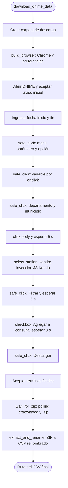
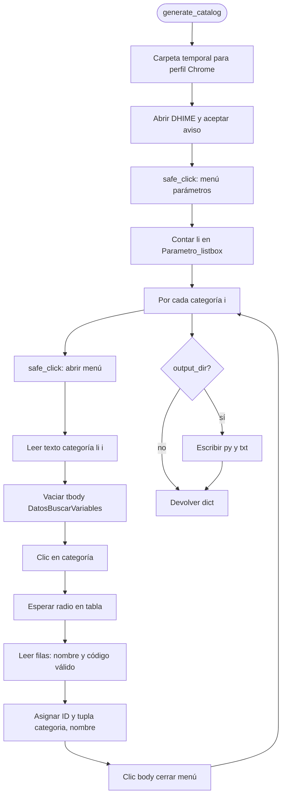

# Algoritmo de descarga DHIME

Este documento describe el flujo implementado en `download_dhime_data` (equivalente al script monolítico original probado en el portal) y el comando oficial de regeneración del catálogo.

## Mapa de módulos

```
ideam_dhime/
├── scraper.py              download_dhime_data (orquestador)
├── driver.py               build_browser: context manager de Chrome
├── navigation.py           safe_click: clics con reintentos y fallback JS
├── station.py              select_station_kendo: inyección Kendo
├── download.py             wait_for_zip + extract_and_rename
├── catalog.py              VARIABLES_IDEAM + CATALOG_GENERATED_AT
├── catalog_builder.py      generate_catalog (reconstrucción del catálogo)
├── regenerate_catalog.py   CLI "ideam-dhime-regenerate" / "python -m ..."
├── constants.py            URLs, XPaths, timeouts, prefs Chrome
└── exceptions.py           DHIMEError y subclases
```

## Diagrama de flujo



## Árbol del algoritmo (paso a paso)

1. **Preparar carpeta**  
   Resolver `download_path` a ruta absoluta y crear directorios si no existen.

2. **Navegador**  
   Iniciar Chrome con preferencias de descarga directa, mismos argumentos de línea de comandos que el script original (contenido mixto, certificados, advertencias de descarga, origen inseguro tratado como seguro para el host DHIME).

3. **Portal inicial**  
   Cargar la URL de atención al ciudadano, marcar la casilla de condiciones y pulsar el botón que habilita el formulario.

4. **Fechas**  
   Rellenar `datepicker` y `datepicker1` con texto + `ENTER`, en el mismo orden que el original.

5. **Parámetro y variable**  
   Abrir el desplegable de parámetros (Kendo), elegir el ítem cuyo texto coincide exactamente con `parameter`.  
   Pulsar el `input` cuyo `onclick` contiene el texto `variable_code` (como en el portal; puede ser nombre visible u otra cadena que el HTML incluya).

6. **Ubicación**  
   Abrir departamento y municipio; elegir ítems por texto exacto en `deptos2_listbox` y `municipio2_listbox`.  
   Clic en `body` para cerrar overlays y **esperar 5 s** para que el servidor cargue estaciones.

7. **Estación (Kendo)**  
   Ejecutar JavaScript que recorre `$("#nombreEstacion").data("kendoDropDownList")`, busca `station_code` en el JSON del ítem y asigna valor + `change`.  
   Si no hay coincidencia, error. Luego **esperar 2 s**.

8. **Filtrar**  
   Clic en el botón “Filtrar” y **esperar 5 s** para la tabla inferior.

9. **Consulta y descarga**  
   Marcar el checkbox de metadatos, “Agregar a la consulta”, **esperar 3 s**, pulsar descarga CSV/ZIP.

10. **Términos finales**  
    Aceptar el diálogo (botón por id `dijit_form_Button_2_label`).

11. **Espera del ZIP**  
    Hasta 60 s: mientras exista `.crdownload` o no haya `.zip`, esperar 1 s.  
    Elegir el `.zip` más reciente cuando termine.

12. **Post-procesado**  
    Cerrar el navegador. Descomprimir el ZIP en la misma carpeta, tomar el `.csv` más reciente, renombrar a  
    `{station_code}-{variable_code}-{date_ini sin /}-{date_fin sin /}.csv` (espacios → `_`), borrar el ZIP.

## Notas

- Los tiempos de espera fijos (`sleep`) forman parte del comportamiento validado ante la lentitud del portal; no deben reducirse sin volver a probar en producción.
- Si el IDEAM cambia IDs o la estructura del mapa ArcGIS/Jimu, habrá que actualizar XPaths y selectores manteniendo la misma estrategia (reintentos de clic, inyección Kendo, etc.).

## Generador del catálogo

Expuesto como **comando oficial** (`ideam-dhime-regenerate` / `python -m ideam_dhime.regenerate_catalog`) definido en [`ideam_dhime/regenerate_catalog.py`](../ideam_dhime/regenerate_catalog.py). Por dentro llama a la función `generate_catalog` de [`ideam_dhime/catalog_builder.py`](../ideam_dhime/catalog_builder.py), que reproduce la lógica del script explorador: despierta el menú Kendo de parámetros, recorre cada ítem de `Parametro_listbox`, espera la tabla `DatosBuscarVariables` y lee filas (celda 1: input; celda 2: `title`/texto del nombre de variable). Asigna IDs enteros secuenciales `1..N` en orden de aparición. Escribe opcionalmente `catalog_generated.py` (para volcar sobre [`catalog.py`](../ideam_dhime/catalog.py) junto con una nueva fecha `CATALOG_GENERATED_AT`) y `guia_variables.txt`.



### Paso a paso del generador

1. Usar `build_browser` sobre un directorio temporal (solo para satisfacer preferencias de Chrome; no se usa la descarga DHIME).
2. Aceptar la pantalla inicial (checkbox + botón habilitar), esperar 3 s.
3. Abrir el menú de parámetros con `safe_click` en el mismo XPath que la descarga; esperar 2 s.
4. Contar elementos `//ul[@id='Parametro_listbox']/li`; cerrar el menú con clic en `body`.
5. Para cada índice `i`: abrir menú, leer texto de la categoría; ignorar vacíos o “Seleccione…”.
6. Vaciar el `tbody` de `#DatosBuscarVariables` vía JavaScript (evita datos obsoletos).
7. Clic en el ítem de categoría; esperar presencia de `input[type=radio]` en la tabla; esperar 1.5 s extra para títulos en celdas.
8. Por cada fila `tr`: leer `value`/`onclick` del input y `title`/texto de la segunda celda; si hay nombre y código válido distinto de `on`, añadir `(categoría, nombre)` al catálogo con el siguiente ID.
9. Clic en `body` para cerrar antes de la siguiente categoría.
10. Si `output_dir` no es `None`, escribir archivos generados y devolver el diccionario.
